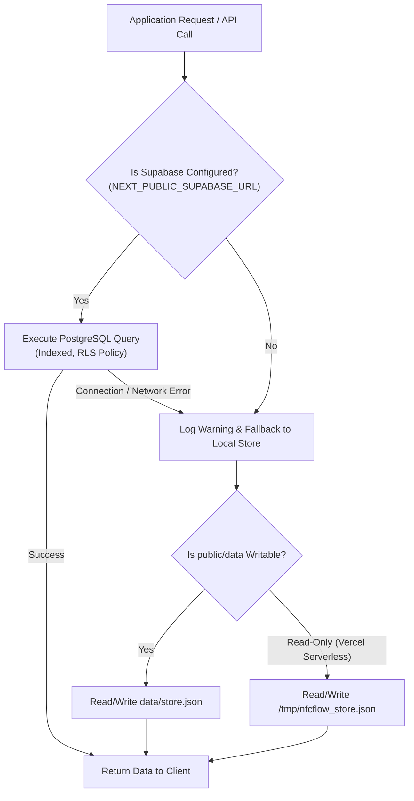
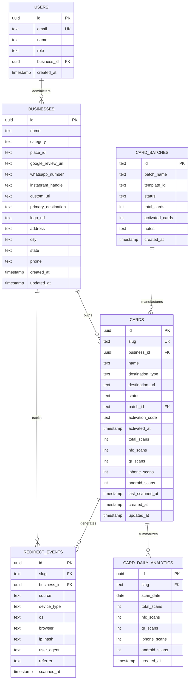

# System Architecture & Data Layer

## 1. Overview & Technology Stack

NFCFlow is built with modern, enterprise-grade technologies selected for high throughput, sub-millisecond execution, type safety, and zero-latency customer experiences:

| Component | Technology | Rationale |
| :--- | :--- | :--- |
| **Framework** | **Next.js 15 (App Router)** | Hybrid rendering (Static Site Generation for marketing/dashboard shells, Serverless/Edge Route Handlers for instant redirection). |
| **Runtime & Language** | **Node.js 20+ & TypeScript 5** | Strict type safety, end-to-end type validation across API contracts, database entities, and client components. |
| **UI & Styling** | **Tailwind CSS 3.4 & Lucide React** | Crisp, tokenized design system adhering to modern SaaS aesthetics, zero CSS bundle bloat, hardware-accelerated 3D transforms. |
| **Primary Database** | **Supabase PostgreSQL** | Cloud-native relational database with connection pooling, Row Level Security (RLS), and high-performance B-tree indexes. |
| **Secondary Storage** | **Transactional File Store** | Local JSON storage with `/tmp` serverless fallback for zero-config local development and disconnected resilience. |
| **Print & Image Engine** | **Sharp & PDF-Lib & QRCode** | Native 300 DPI vector-to-raster PNG generation, SVG composition, and CMYK/RGB multi-card PDF sheet imposition. |

---

## 2. Directory Structure

```
e:\ReviewCard/
├── app/                              # Next.js 15 App Router
│   ├── (auth)/login/                # Super Admin login portal
│   ├── activate/                     # Customer self-serve card activation
│   ├── manage/                       # Business Owner self-serve portal
│   ├── dashboard/                    # Super Admin management studio
│   │   ├── analytics/                # Global scan telemetry & velocity
│   │   ├── batches/                  # Bulk manufacturing batches & inventory
│   │   ├── businesses/               # Multi-tenant business management
│   │   ├── cards/                    # Card directory & per-card studio
│   │   ├── generator/                # Print layout studio & batch generator
│   │   ├── hardware/                 # NFC chip programming guides
│   │   └── settings/                 # Global preferences & database wipe
│   ├── api/                          # REST API route handlers
│   │   ├── activation/               # Activation verification & claiming
│   │   ├── admin/                    # System administration & maintenance
│   │   ├── analytics/                # Telemetry queries & rollups
│   │   ├── auth/                     # Session authentication
│   │   ├── batches/                  # Batch CRUD & CSV exports
│   │   ├── businesses/               # Business tenant management
│   │   ├── cards/                    # Card CRUD & 300 DPI image exports
│   │   ├── cron/cleanup-telemetry/   # 60-day rolling log retention cron
│   │   ├── manage/                   # Owner card destination update
│   │   ├── print-jobs/               # Async PDF & ZIP batch generation
│   │   ├── supabase/                 # Supabase sync & status diagnostics
│   │   └── templates/                # Visual card template registry
│   └── r/                            # Redirection Engine
│       ├── [slug]/route.ts           # Ultra-fast 302 dynamic redirect handler
│       ├── inactive/page.tsx         # Deactivated card notification
│       ├── invalid/page.tsx          # Non-existent card notification
│       └── unactivated/page.tsx      # Unclaimed inventory onboarding
├── components/                       # Reusable React components
│   ├── analytics/                    # Device & scan charts, log tables
│   ├── card-preview/                 # ISO CR80 PVC card previewers & 3D flip
│   ├── dashboard/                    # Header, sidebar navigation, layout
│   ├── generator/                    # Template customization modal
│   ├── nfc/                          # NFC Tools write helper
│   ├── qr/                           # Dynamic QR generator & downloaders
│   └── ui/                           # Button, Badge, Modal, Card atoms
├── docs/                             # Technical Documentation Suite
├── lib/                              # Core logic & utilities
│   ├── csv/                          # CSV parsing & batch import validation
│   ├── db/                           # Store abstraction, schema, Supabase client
│   ├── print/                        # SVG generator & PDF-Lib print engine
│   ├── redirect/                     # Destination validator & URL parser
│   ├── supabase/                     # Supabase SSR & client instances
│   ├── templates/                    # Card templates & sheet imposition rules
│   └── utils.ts                      # URL constructors & formatting
├── public/                           # Static assets, branding, and templates
└── types/                            # Core TypeScript interface definitions
```

---

## 3. Dual-Layer Storage Engine

To guarantee resilience across diverse deployment environments (local machine, Docker container, Vercel serverless functions, cloud VMs), NFCFlow implements an intelligent **Dual-Layer Storage Abstraction** in [`lib/db/store.ts`](file:///e:/ReviewCard/lib/db/store.ts):



### Key Storage Characteristics:
- **Cloud Mode (Supabase)**: When configured, all operations execute directly on Supabase PostgreSQL with high-concurrency connection pooling.
- **Serverless Fallback (`/tmp`)**: On read-only serverless lambdas (Vercel/AWS), if local disk writing is attempted, the storage layer automatically redirects file writes to `os.tmpdir()` (`/tmp/nfcflow_data`), preventing `EROFS: read-only file system` crashes.

---

## 4. PostgreSQL Relational Database Schema

The database architecture is designed with strict relational integrity, cascade deletions, comprehensive check constraints, and performance indexes:

### Entity Relationship Diagram (ERD)



---

## 5. Performance Indexes & Query Optimization

To maintain sub-15ms redirect resolution even with millions of rows in `redirect_events`, the following indexes are implemented in [`lib/db/schema.sql`](file:///e:/ReviewCard/lib/db/schema.sql):

```sql
-- Fast card lookup by slug (Essential for /r/[slug] redirect speed)
CREATE INDEX IF NOT EXISTS idx_cards_slug ON cards(slug);

-- Fast business filtering for multi-tenant queries
CREATE INDEX IF NOT EXISTS idx_cards_business_id ON cards(business_id);
CREATE INDEX IF NOT EXISTS idx_cards_status ON cards(status);
CREATE INDEX IF NOT EXISTS idx_cards_batch_id ON cards(batch_id);

-- Telemetry query indexes for analytics dashboard and 60-day rolling cleanup
CREATE INDEX IF NOT EXISTS idx_redirect_events_slug ON redirect_events(slug);
CREATE INDEX IF NOT EXISTS idx_redirect_events_business_id ON redirect_events(business_id);
CREATE INDEX IF NOT EXISTS idx_redirect_events_scanned_at ON redirect_events(scanned_at DESC);
CREATE INDEX IF NOT EXISTS idx_redirect_events_cleanup ON redirect_events(scanned_at, slug);

-- Daily aggregation index
CREATE UNIQUE INDEX IF NOT EXISTS idx_card_daily_analytics_slug_date ON card_daily_analytics(slug, scan_date);
```
