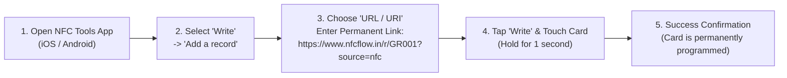

# NFC Hardware, Chip Programming & Deployment Guide

This guide covers physical chip selection, memory standards, mobile programming workflows, and countertop deployment best practices.

---

## 1. NFC Chip Comparison & Selection

| Specification | NXP NTAG213 (Recommended) | NXP NTAG215 | NXP NTAG216 |
| :--- | :--- | :--- | :--- |
| **Total Memory** | **180 Bytes** | 540 Bytes | 924 Bytes |
| **Usable User Memory** | **144 Bytes** | 504 Bytes | 888 Bytes |
| **URL Length Capacity** | **Up to 132 characters** | Up to 492 characters | Up to 850 characters |
| **Standard Review URL** | `https://www.nfcflow.in/r/GR001?source=nfc` ($43\text{ chars}$) — **Only 30% of memory used!** | Fits easily | Fits easily |
| **Unit Cost** | **Lowest (Optimal for bulk deployments)** | Medium | High |
| **Native iOS / Android Background Reading** | ✅ Yes (iPhone 7+ / iOS 13+, all modern Android) | ✅ Yes | ✅ Yes |
| **Write Cycles** | 100,000 writes | 100,000 writes | 100,000 writes |
| **Data Retention** | 10 Years | 10 Years | 10 Years |

> [!TIP]
> **NXP NTAG213** is the industry standard for NFC review cards. It provides the fastest read speeds, lowest component cost, and more than double the memory required for NFCFlow redirect URLs.

---

## 2. Step-by-Step Chip Programming (NFC Tools App)

NFCFlow cards can be programmed using any NFC-enabled smartphone (iPhone or Android) with the free **NFC Tools** app:



### Programming Steps:
1. Download **NFC Tools** by *wakdev* from the [Apple App Store](https://apps.apple.com) or [Google Play Store](https://play.google.com).
2. Open the app and tap **Write** $\rightarrow$ **Add a record**.
3. Select **Custom URL / URI**.
4. Enter the card's permanent redirect URL with the NFC attribution tag:
   ```text
   https://www.nfcflow.in/r/YOUR_SLUG?source=nfc
   ```
5. Tap **OK**, then tap **Write / 43 Bytes**.
6. Hold your phone against the card:
   - **iPhone**: Hold the top edge of the iPhone against the center/top of the card.
   - **Android**: Hold the center back of the phone against the card.
7. A checkmark and haptic vibration confirm the chip has been written!

---

## 3. Retail Countertop Deployment Best Practices

### ⚠️ Metal Surface Interference Warning:
Standard NFC cards use a 13.56 MHz High Frequency electromagnetic field. **If a card is placed directly on a metal surface (stainless steel register counter, aluminum desk), the metal absorbs the RF energy and prevents reading.**

**Solutions:**
- Place cards on wooden, acrylic, glass, or plastic counter stands.
- If placing on metal counters, use cards manufactured with a built-in **ferrite anti-metal shielding layer**.

### 🛎️ 3-Second Customer Prompt Script:
Train front-desk staff or servers with this simple script:
> *"Thank you for visiting today! If you enjoyed your experience, you can simply tap your phone right here on this card to leave us a quick 5-star Google review in 3 seconds!"*

### 📍 Strategic Placement Locations:
- **Restaurants & Cafes**: Next to the billing POS terminal, or embedded into table acrylic standees.
- **Salons & Spas**: At the checkout reception desk or styling mirrors.
- **Hotels & Homestays**: Keycard holders, reception desks, and concierge counters.
- **Clinics & Dental Centers**: Patient checkout counter.
