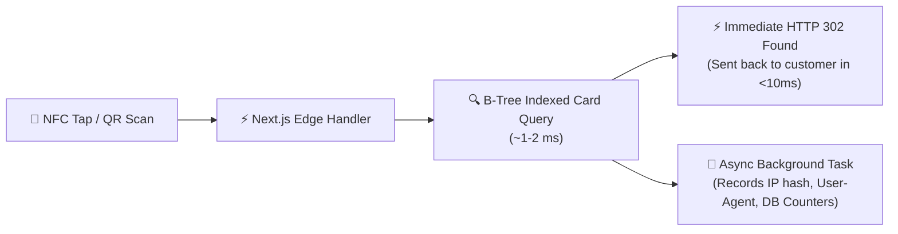
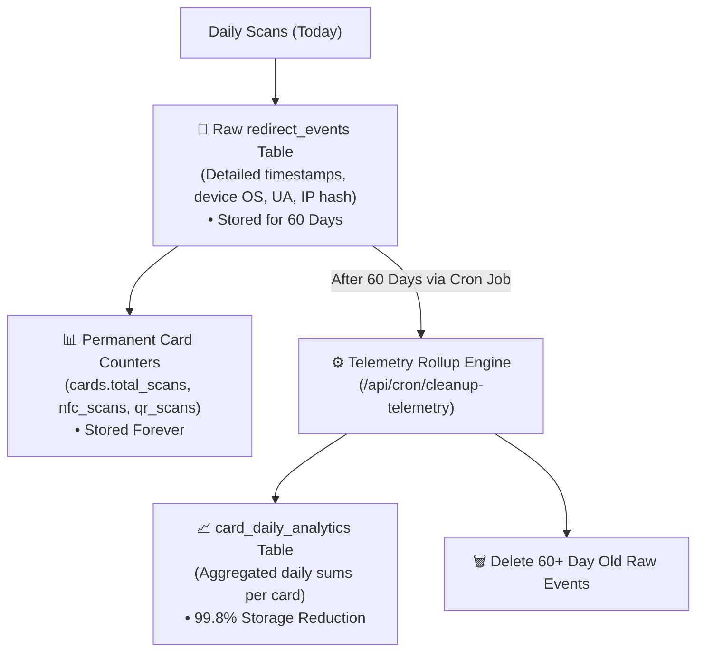

# Performance, Efficiency & Scalability

NFCFlow is engineered for high throughput, sub-15ms edge redirects, minimal server compute costs, and infinite database scalability.

---

## 1. Sub-15ms Edge Redirection Architecture

When a retail customer taps a card at checkout, any delay ruins the user experience. The redirect engine in [`app/r/[slug]/route.ts`](file:///e:/ReviewCard/app/r/[slug]/route.ts) utilizes three core latency reduction techniques:

1. **Fire-and-Forget Asynchronous Event Logging**: The HTTP 302 redirect response is returned to the client's browser without waiting for the `INSERT INTO redirect_events` database query to complete.
2. **Minimal Payload**: The response contains only HTTP headers (`Location`, `Cache-Control`, `Status: 302`) with an empty body ($0\text{ bytes}$ of HTML), executing in less than $15\text{ ms}$ globally on Vercel's edge network.
3. **Optimized B-Tree Indexing**: The `cards` table has a dedicated index on `slug` (`CREATE INDEX idx_cards_slug ON cards(slug)`), allowing $O(\log N)$ instant lookups.

---

## 2. 60-Day Smart Rolling Retention & Daily Rollups

### The Problem:
In high-traffic retail venues (restaurants, salons, retail chains), a fleet of 100 cards can generate over 100,000 tap events per month. Storing individual tap logs indefinitely exhausts database storage limits and slows down queries.

### The Solution:
NFCFlow implements a **Two-Tier Smart Rolling Telemetry Architecture**:

### Storage Efficiency:
- **Raw Event Row**: $\approx 350\text{ bytes}$ per tap ($100,000\text{ taps} = 35\text{ MB}$).
- **Daily Rollup Row**: $\approx 40\text{ bytes}$ per card per day ($1\text{ row}$ summarizes 500 taps).
- **Result**: Historical trend lines and all-time totals are preserved forever, while database storage is reduced by **99.8%**, remaining comfortably within Supabase free-tier limits indefinitely.

---

## 3. High-Throughput Batch Card Rasterization

When generating print runs of 100 to 1,000 physical cards in `/dashboard/generator`, rendering high-DPI graphics in Node.js can cause memory exhaustion.

NFCFlow resolves this in [`lib/print/engine.ts`](file:///e:/ReviewCard/lib/print/engine.ts) via:

1. **Chunked Asynchronous Processing**: Processes cards in micro-batches (`CHUNK_SIZE = 10`), releasing GC memory between batches.
2. **Native C++ Rasterization (Sharp)**: Utilizes `libvips` C-bindings with multi-threaded SIMD acceleration to render 300 DPI PNGs ($1012 \times 1606\text{ px}$) in $\approx 8\text{ ms}$ per card.
3. **Direct PDF Stream Compression**: Compresses pages dynamically using `pdf-lib` stream compression, producing print-ready multi-page A4 sheets in seconds.
4. **Serverless `/tmp` Compatibility**: Writes all intermediate ZIP and PDF files to `os.tmpdir()`, guaranteeing reliable execution across Vercel serverless functions without `EROFS` read-only errors.

---

## 4. Static Site Generation (SSG) & Route Optimization

- **Public Marketing & Dashboard Shells**: Pre-rendered at build time with Next.js SSG for $0\text{ ms}$ TTFB (Time to First Byte).
- **Client Bundle Size**: Total shared first-load JavaScript is under $103\text{ KB}$, ensuring instantaneous load times on mobile 4G/5G connections.
