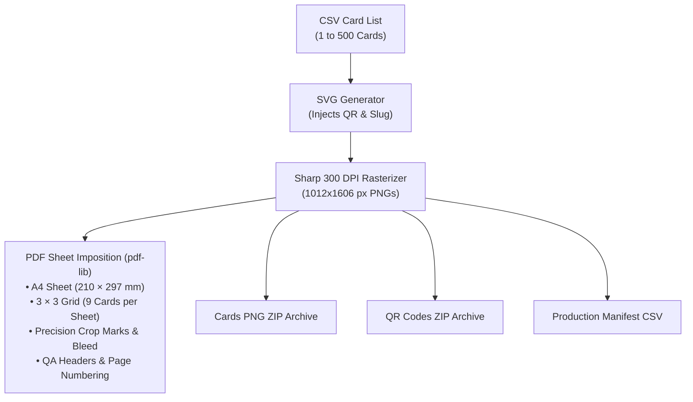

# Card Print Studio & Commercial Manufacturing

NFCFlow includes a complete physical print and prepress engine designed for standard commercial PVC card manufacturing, dye-sublimation sheets, and direct-to-card thermal printers.

---

## 1. Physical Card Specifications (ISO/IEC 7810 CR80)

All card templates strictly adhere to the global bank card standard:

| Dimension | Standard Specification | Prepress Value (with 2mm Bleed) |
| :--- | :--- | :--- |
| **Card Format** | **ISO/IEC 7810 ID-1 (CR80)** | Prepress Imposition Sheet |
| **Width** | $85.60\text{ mm}$ (3.370 inches) | $89.60\text{ mm}$ ($85.60 + 2\times 2\text{ mm}$) |
| **Height** | $53.98\text{ mm}$ (2.125 inches) | $57.98\text{ mm}$ ($53.98 + 2\times 2\text{ mm}$) |
| **Corner Radius** | $3.18\text{ mm}$ (0.125 inches) | Die-cut rounded corner |
| **Thickness** | $0.76\text{ mm}$ (30 mil) | Solid PVC / Matte / Glossy |
| **Resolution** | **300 DPI Commercial** | $1012 \times 1606\text{ px}$ per side |

---

## 2. Dual-Sided Visual Artwork Anatomy

```
┌──────────────────────────────────────────────────┐
│  FRONT SIDE: Contactless Tap Surface             │
│  ──────────────────────────────────────────────  │
│  [======== Diagonal Google 4-Color Bar ========] │
│                                                  │
│                    [   G   ]                     │
│                  G o o g l e                     │
│                   ★★★★★                          │
│               RATE US 5-STARS                    │
│                                                  │
│               ((·)) Tap Phone                    │
│                  NFCFlow                         │
└──────────────────────────────────────────────────┘

┌──────────────────────────────────────────────────┐
│  BACK SIDE: Optical Scan Surface                 │
│  ──────────────────────────────────────────────  │
│                  SCAN TO REVIEW                  │
│                                                  │
│                 ┌──────────────┐                 │
│                 │  QR CODE     │                 │
│                 │  (300 DPI)   │                 │
│                 └──────────────┘                 │
│               nfcflow.in/r/{slug}                │
│                                                  │
│         Card ID: GR001 • Key: 49K2-X8L1         │
│             [ Business Name Logo ]               │
└──────────────────────────────────────────────────┘
```

### Artwork Highlights:
- **Front Side**: Google G icon, authentic multi-color wordmark (`#4285F4`, `#EA4335`, `#FBBC05`, `#34A853`), 5 golden review stars, and contactless tap indicator.
- **Back Side**: High-contrast Level H error-corrected dynamic QR code, human-readable fallback URL, Secret Activation Key, and merchant branding.

---

## 3. Prepress PDF Imposition & Sheet Layout

For batch printing on standard A4 or US Letter PVC split sheets, NFCFlow's prepress engine (`lib/print/engine.ts`) automatically arranges cards into a precision grid:



### Prepress Controls:
- **Commercial Bleed**: $2.0\text{ mm}$ bleed surrounding card artwork to eliminate white edge defects during rotary die-cutting.
- **Crop Marks**: Precision crosshairs indicating cutting alignment lines.
- **Production QA Text**: Prints Card ID and Activation Code outside the die-cut boundaries for factory inspection.

---

## 4. Printer Compatibility Guide

NFCFlow exports are natively compatible with:

1. **Direct-to-Card Thermal Printers**: Fargo DTC1250e / DTC1500, Zebra ZC300 / ZXP Series, Evolis Primacy 2 / Zenius, Magicard 300.
2. **Re-transfer PVC Printers**: Fargo HDP5000, Zebra ZXP Series 9 (photographic edge-to-edge printing).
3. **Offset / Commercial Screen Print Houses**: Export lossless **Vector SVG** for Adobe Illustrator and CorelDraw workflows.
