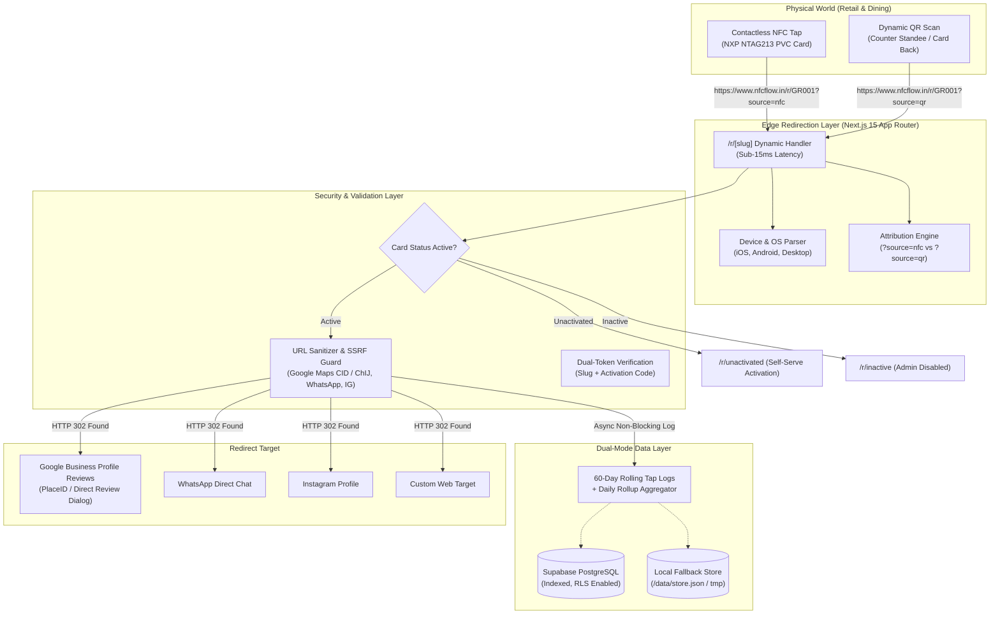

# NFCFlow Technical Documentation Suite

Welcome to the complete technical documentation for **NFCFlow** — a modern B2B SaaS platform for physical PVC NFC review cards, dynamic QR standees, sub-millisecond edge redirection, automated scan telemetry, and commercial print generation.

---

## 📚 Documentation Sitemap

| Document | Description | Target Audience |
| :--- | :--- | :--- |
| **[1. Architecture & Data Model](ARCHITECTURE.md)** | System architecture, Next.js 15 App Router structure, dual-layer persistence (Supabase PostgreSQL + local JSON fallback), database schemas, and data flow diagrams. | Engineers, Architects |
| **[2. Redirect Engine & Routing](REDIRECT_ENGINE.md)** | Edge routing (`/r/[slug]`), sub-15ms redirect resolution, HTTP 302 caching strategies, user-agent device parsing, source attribution (`nfc` vs `qr`), and offline card states. | Engineers, DevOps |
| **[3. Security & Authorization](SECURITY.md)** | Super Admin vs Business Owner permissions, dual-token card ownership (`slug` + `activation_code`), open-redirect/SSRF defenses, URL sanitizers, edge middleware guards, and Supabase RLS. | Security Teams, Engineers |
| **[4. Complete API Reference](API_REFERENCE.md)** | Comprehensive documentation of all REST API endpoints, request payloads, response contracts, status codes, query filters, and error models. | Frontend/Backend Developers, Integrators |
| **[5. Performance & Scalability](PERFORMANCE_AND_SCALABILITY.md)** | Edge runtime optimization, non-blocking telemetry logging, 60-day rolling log retention with automatic daily rollups, database indexing, and memory efficiency. | DevOps, System Architects |
| **[6. Print Studio & Card Manufacturing](PRINT_AND_MANUFACTURING.md)** | ISO/IEC 7810 CR80 physical standards, dual-sided SVG/PNG generation, 300 DPI Sharp rasterization, commercial bleed, PDF sheet imposition, and thermal card printer setups. | Print Ops, Hardware Teams |
| **[7. NFC Hardware & Deployment](NFC_HARDWARE_GUIDE.md)** | NXP NTAG213 chip technical specifications, NDEF URL writing with NFC Tools (iOS/Android), retail counter placement, and customer review workflows. | Operations, Field Technicians |
| **[8. Deployment & DNS Configuration](DEPLOYMENT_AND_DNS.md)** | Vercel production hosting, apex/www domain DNS setup, SSL SNI certificate validation, Supabase cloud migration, environment variables, and automated crons. | DevOps, Sysadmins |

---

## 🏗️ High-Level System Architecture

---

## ⚡ Core Philosophy & Design Decisions

1. **Zero Reprinting Cost**: Physical cards are programmed with permanent static redirect URLs (e.g. `https://www.nfcflow.in/r/GR001`). If a business moves, changes review platforms, or updates their profile link, the change is instant in the dashboard without re-manufacturing physical PVC chips.
2. **Sub-15ms Redirection Speed**: The redirect engine uses non-blocking asynchronous telemetry writes and HTTP `302 Found` headers with `Cache-Control: public, max-age=0, must-revalidate` to ensure real-time destination updates with lightning-fast tap-to-review customer experience.
3. **Smart Rolling Telemetry (60-Day Cap)**: To prevent runaway database growth on high-volume retail deployments, individual tap events are preserved for 60 days for deep analytics, while permanent counters (`nfc_scans`, `qr_scans`, `iphone_scans`, `android_scans`) and daily summary tables retain all-time statistics forever.
4. **Resilient Dual-Mode Architecture**: Works with Supabase PostgreSQL cloud sync in production and automatically falls back to transactional local JSON storage during local development or offline environments.
