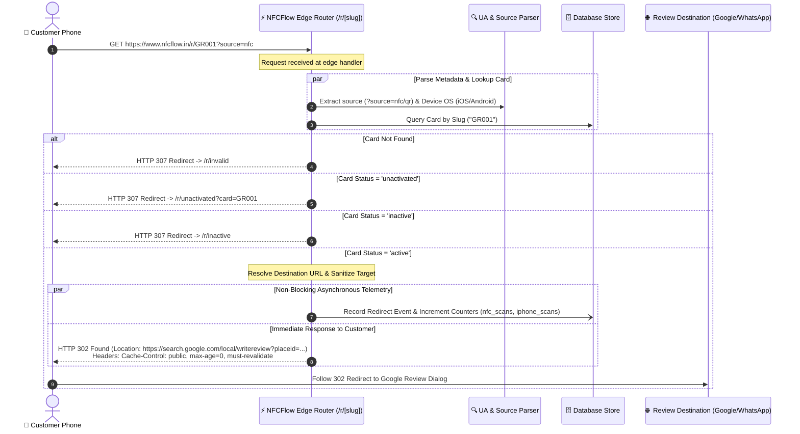

# Redirection Engine & Edge Routing

The heart of NFCFlow is its dynamic redirection engine, located in [`app/r/[slug]/route.ts`](file:///e:/ReviewCard/app/r/[slug]/route.ts). It converts a physical tap or QR scan into an instant, secure destination redirect with zero latency perceptible to the customer.

---

## 1. Redirection Workflow Diagram



---

## 2. Why HTTP 302 Found (vs HTTP 301 Permanent)?

A critical architectural decision in NFCFlow is returning **HTTP 302 Found** (Temporary Redirect) rather than HTTP 301 Moved Permanently:

| HTTP Status | Behavior | Impact on Dynamic Review Cards |
| :--- | :--- | :--- |
| **301 Moved Permanently** | Browsers cache the destination indefinitely on the customer's device. | ❌ **Fatal Flaw**: If a business changes their destination from Google to WhatsApp, any customer who previously tapped the card will continue opening the old cached link. |
| **302 Found** | Browsers fetch the latest destination from the server on every tap. | ✅ **Required**: Allows real-time instant destination switching from the dashboard without reprint costs. |

### Caching Headers Applied:
```http
HTTP/1.1 302 Found
Location: https://search.google.com/local/writereview?placeid=ChIJ...
Cache-Control: public, max-age=0, must-revalidate
Pragma: no-cache
Expires: 0
```

---

## 3. Source Attribution & Telemetry Capture

When a customer taps an NFC card or scans a QR code, the request contains query parameters and HTTP headers that are parsed in real time:

### Attribution Parameters:
- **NFC Tap**: Chip is programmed with `https://www.nfcflow.in/r/{slug}?source=nfc`
- **QR Code Scan**: Printed QR contains `https://www.nfcflow.in/r/{slug}?source=qr`
- **Fallback / Direct**: If no `source` parameter is present, defaults to `direct`.

### User-Agent Device Detection:
The server inspects the `User-Agent` string to categorize hardware platforms:
```ts
const userAgent = request.headers.get("user-agent") || "";
let deviceType: "mobile" | "tablet" | "desktop" | "unknown" = "unknown";
let os: "ios" | "android" | "windows" | "macos" | "linux" | "other" = "other";

if (/iPad|iPhone|iPod/.test(userAgent)) {
  deviceType = "mobile";
  os = "ios";
} else if (/Android/.test(userAgent)) {
  deviceType = "mobile";
  os = "android";
} else if (/Windows/.test(userAgent)) {
  deviceType = "desktop";
  os = "windows";
} else if (/Macintosh|Mac OS X/.test(userAgent)) {
  deviceType = "desktop";
  os = "macos";
}
```

---

## 4. Sub-15ms Latency Engineering

To ensure customer reviews happen in seconds at billing counters, every unnecessary millisecond is eliminated:

1. **Non-Blocking Telemetry Writes**: Telemetry logging (`recordRedirectEvent`) is dispatched asynchronously without blocking the immediate transmission of the HTTP 302 headers to the customer's phone.
2. **Lean Database Queries**: The slug lookup query uses an indexed B-tree index `idx_cards_slug`, executing in under $2\text{ ms}$ on PostgreSQL.
3. **Connection Pooling**: Reuses pre-established SSL/TLS connection pools between the Next.js runtime and Supabase.

---

## 5. Card Lifecycle States & Handling

| Card Status | Description | Edge Route Action |
| :--- | :--- | :--- |
| **`active`** | Card is assigned to a business and verified. | Instantly returns **HTTP 302** redirecting to target destination. |
| **`unactivated`** | Physical card is in warehouse stock or shipped to a customer who hasn't claimed it yet. | Returns **HTTP 307** redirecting to `/r/unactivated?card={slug}`, guiding the customer to enter their Secret Activation Code. |
| **`inactive`** | Business paused card or admin temporarily disabled it. | Returns **HTTP 307** redirecting to `/r/inactive` with a branded friendly notification. |
| **Non-existent** | Slug does not exist in the database. | Returns **HTTP 307** redirecting to `/r/invalid`. |
