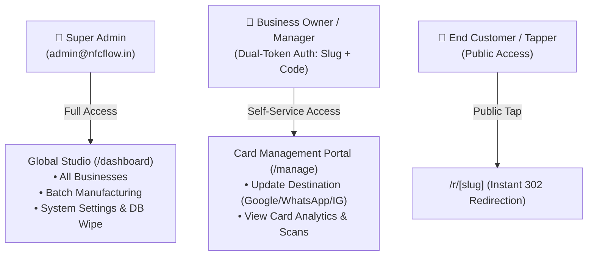
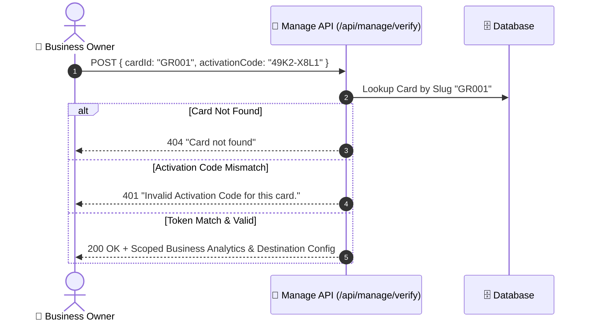

# Security, Authentication & Authorization

Security is foundational to NFCFlow. Because review cards are deployed in public retail environments, the platform implements multi-layered defenses against unauthorized redirects, card hijacking, SSRF attacks, and multi-tenant data leaks.

---

## 1. Role Hierarchy & Access Control



---

## 2. Dual-Token Card Ownership Verification

A physical card's redirect slug (e.g. `GR001`) is publicly discoverable because any person tapping the card can see `https://www.nfcflow.in/r/GR001` in their browser.

To prevent malicious actors from guessing a slug and changing where a business's card points, NFCFlow implements **Dual-Token Authentication** in [`app/api/manage/verify/route.ts`](file:///e:/ReviewCard/app/api/manage/verify/route.ts) and [`app/api/manage/update/route.ts`](file:///e:/ReviewCard/app/api/manage/update/route.ts):



### Protection Rules:
1. **Secret Activation Code**: Every card is printed with a cryptographically generated high-entropy activation code (e.g., `49K2-X8L1` or `A7B9-C3D4`) stored securely in the database.
2. **Self-Service Verification**: To update a card's destination from `/manage`, the requester MUST supply both the Card Slug AND the valid Secret Activation Code.
3. **Zero Administrative Burden**: Business owners can reconfigure their review targets instantly without needing to remember complex passwords or create user accounts.

---

## 3. Open Redirect & SSRF Prevention

Because destination URLs can be configured dynamically, the platform enforces strict URL validation in [`lib/redirect/validator.ts`](file:///e:/ReviewCard/lib/redirect/validator.ts) before any destination is saved or executed:

### Validation Rules:
1. **Protocol Restriction**: Only `https://` protocols are allowed. `http://`, `javascript:`, `data:`, `file:`, and local network addresses (`127.0.0.1`, `localhost`, `10.0.0.0/8`, `192.168.0.0/16`) are strictly rejected to prevent Server-Side Request Forgery (SSRF).
2. **Google Review URLs**: Validates authentic Google Review formats:
   - Direct Place ID: `https://search.google.com/local/writereview?placeid=ChIJ...`
   - Maps Search: `https://www.google.com/maps/search/?api=1&query=...&query_place_id=...`
   - Short Links: `https://g.page/r/.../review` or `https://maps.app.goo.gl/...`
3. **WhatsApp Destinations**:
   - Strictly normalizes phone numbers into international E.164 format (removing spaces, dashes, leading zeros).
   - Generates safe API links: `https://wa.me/{sanitized_phone}?text={encoded_message}`.
4. **Instagram Destinations**:
   - Strips leading `@` symbols and whitespace.
   - Generates sanitized URLs: `https://instagram.com/{handle}`.

---

## 4. Edge Middleware & Route Protection

Route authorization is enforced at the edge via [`middleware.ts`](file:///e:/ReviewCard/middleware.ts):

```ts
// Protected route matcher
export const config = {
  matcher: ["/dashboard/:path*", "/api/batches/:path*", "/api/admin/:path*"],
};
```

### Security Measures:
- **Admin Session Token**: Requests to `/dashboard/*` verify the admin session cookie. Unauthenticated requests are redirected to `/login?from=...`.
- **CORS Configuration**: Restricts API mutation endpoints (`POST`, `PATCH`, `DELETE`) to the configured `NEXT_PUBLIC_APP_URL`.
- **Content Security Policy (CSP)**: Disallows `eval()` execution and enforces strict framing policies (`X-Frame-Options: SAMEORIGIN`) to prevent clickjacking.

---

## 5. Supabase Row Level Security (RLS)

When running on Supabase PostgreSQL, all tables have Row Level Security enabled in [`lib/db/schema.sql`](file:///e:/ReviewCard/lib/db/schema.sql):

```sql
ALTER TABLE businesses ENABLE ROW LEVEL SECURITY;
ALTER TABLE cards ENABLE ROW LEVEL SECURITY;
ALTER TABLE redirect_events ENABLE ROW LEVEL SECURITY;
ALTER TABLE card_daily_analytics ENABLE ROW LEVEL SECURITY;

-- Anonymous public edge read access for /r/[slug] resolution
CREATE POLICY "Public anonymous read access for redirection"
    ON cards FOR SELECT
    USING (true);

-- Event insertion from public edge
CREATE POLICY "Public edge can insert telemetry events"
    ON redirect_events FOR INSERT
    WITH CHECK (true);
```
